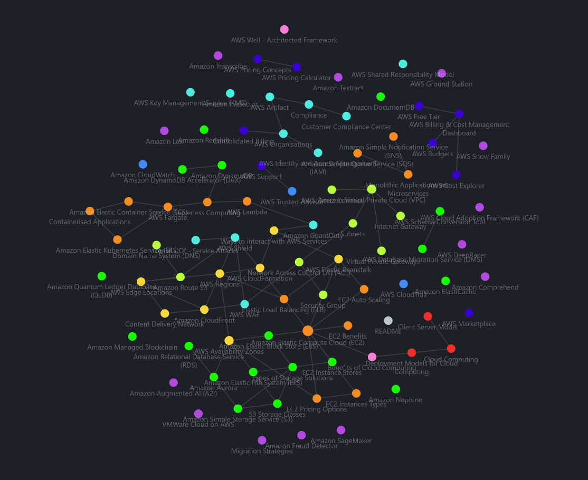

# 42KL-Piscine-Cloud

42KL's Piscine for obtaining the AWS Cloud Practitioner Essentials Certification.

This repository contains notes for the AWS Cloud Practitioner Essentials Course, in preparation for the AWS Cloud Practitioner Essential Certification Examination, written in Obsidian.

---

## Dependencies
- Obsidian

## Installation

1. Install [Obsidian](https://obsidian.md/download).
2. Clone this repository `git clone https://github.com/LaiAnTan/42KL-Piscine-Cloud`
3. Open Obsidian > Open Folder As Vault > Select the cloned repository.
